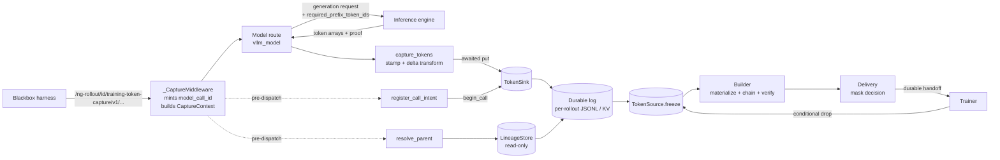
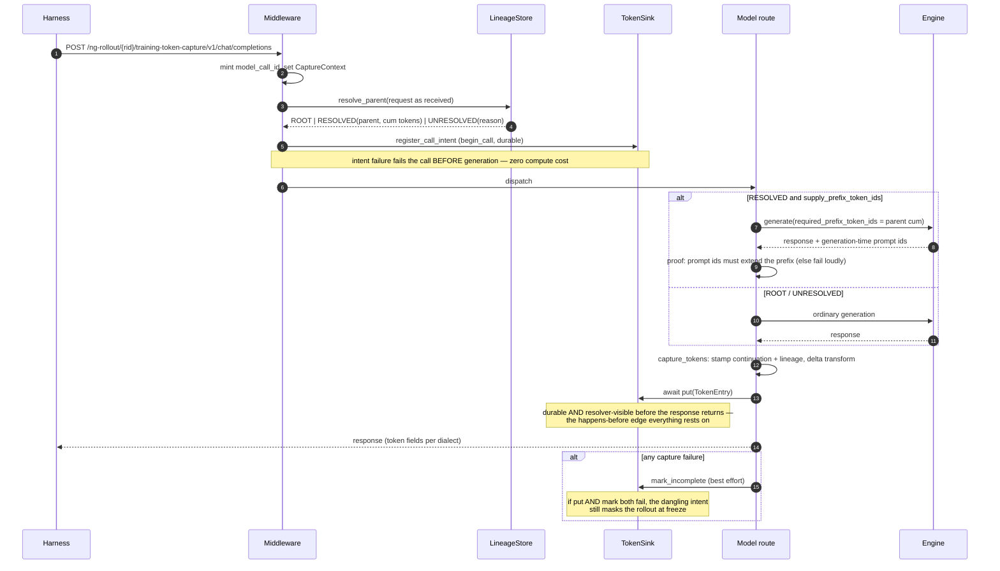
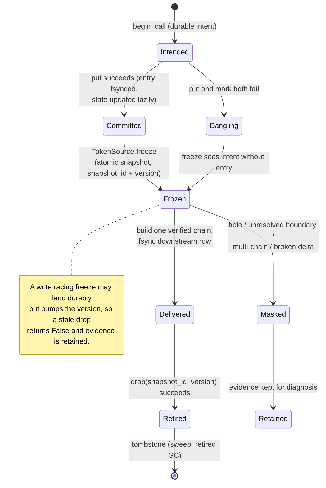
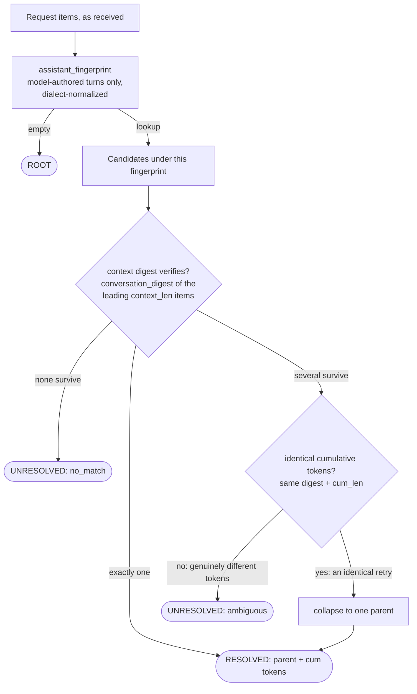
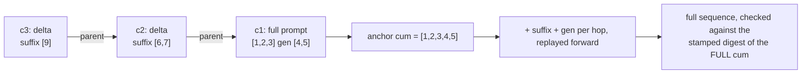
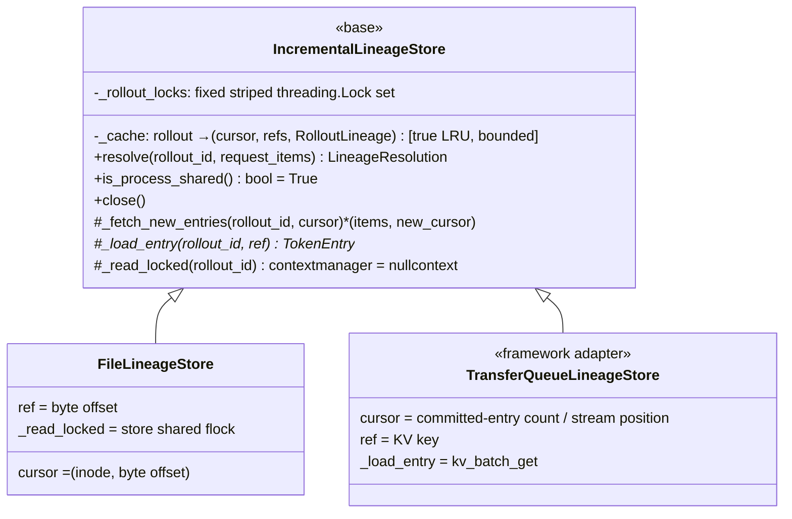

# Token-ID Capture — Design

**Maintenance rule: this document is updated in the same commit as any change to the
architecture, interfaces, control flow, data flow, storage model, or error handling of this
package.** A PR that changes behavior here without touching this file is incomplete. Append a
line to the Changelog (§11) for every such change.

## 1. Purpose and the one invariant

RL training needs, for every model call an agent made: the exact prompt token ids the engine
conditioned on, the exact token ids it sampled, and their sampling-time log probabilities.
Blackbox agent harnesses (Claude Code, SWE agents, …) return text, not tokens, and reshape
conversation history between calls — so tokens must be captured at the one chokepoint every
call passes through: Gym's model server.

**The guaranteed invariant is token-chain exactness:** a delivered trajectory contains exactly
the tokens the policy emitted, conditioned on exactly the recorded context, as one contiguous
sequence. Conversation *fidelity* is not promised — fields the lineage hashes deliberately
ignore (reasoning content, an item inserted between the verified context and the echoed output)
may differ from the harness's rendering without breaking the invariant. Every layer prefers
losing a sample (masking) to fabricating one; there is no path on which a guessed or corrupted
token sequence is delivered as trainable.

## 2. Components

| Module | Role |
|---|---|
| `protocols.py` | The external contract: `TokenSink`, `TokenSource`, `LineageStore` (+ optional sink extension `begin_call`). Leaf-importable: no fastapi/ray/torch. |
| `records.py` | `TokenEntry` (schema §6), digests (`compute_digest`, `encode_token_ids`), `stamp_lineage`. |
| `lineage.py` | Canonicalization + hashing (`assistant_fingerprint`, `conversation_digest`, `FINGERPRINT_VERSION`), the matcher (`RolloutLineage`), `IncrementalLineageStore` (base every backend subclasses), `FileLineageStore` (file-backed reference), `InMemoryLineageStore` (tests only). |
| `sink.py` | `CaptureContext` (per-call identity + parent decision + delta mode + prefix intent/proof), `resolve_parent`, `register_call_intent`, `capture_tokens`/`commit_entry`, worker health counters (`capture_health_snapshot`). |
| `store.py` | `TokenCaptureStore`: per-rollout JSONL + flock + state (freeze/version/tombstone), intents, `sweep_retired` GC. Default `TokenSink` and `TokenSource`. |
| `builder.py` | Offline reconstruction: delta materialization, parent-link chaining with digest verification, missing-parent recovery, retry-sibling resolution, projection. |
| `consumer.py` / `delivery.py` | Freeze → build → mask decision → durable handoff → conditional retirement. |
| `config.py` | `token_id_capture` settings block; startup validation (incl. sink-requires-resolver). |
| `conformance.py` | Executable contract checks an external backend runs against its sink/source/lineage adapters. |

## 3. Control flow — one captured model call

Unobserved paths under the capture prefix mark the rollout incomplete before forwarding: an
uncapturable call must not look like a complete rollout.

## 4. Data flow — record lifecycle

Write path: entry line appended to `<rollout>.tokens.jsonl` + fsync (the durability
guarantee); the state index is updated atomically *without* fsync (reconstructible from the
JSONL tail; fsynced on lifecycle transitions only). Intents live in a `.intents` sidecar.

Read path (serving): the resolver indexes **metadata only** (~hundreds of bytes per call) and
lazily materializes tokens for the single RESOLVED winner, behind a digest interlock; see §8.
Cache eviction of a live rollout is a performance event (cold re-fetch), never a correctness
event.

## 5. Lineage resolution

Outcomes are persisted on every record with their diagnostic `parent_resolution_reason`.
UNRESOLVED is never guessed across; it starts a masked fragment. The hashes are a cross-repo
wire contract: `FINGERPRINT_VERSION` is stamped on entries and gated at indexing; golden
vectors (`tests/unit_tests/token_capture_golden_vectors.json`) pin them, including
cross-dialect equality. The builder independently re-verifies every claimed link by digest —
the defense-in-depth that makes the §9 contract relaxations safe. Token-prefix matching
survives for exactly one purpose: recovering a RESOLVED link whose parent is absent from the
build; a missing decision masks (`missing_resolution`) rather than infers.

## 6. Record schema (`TokenEntry`) — fields and why they are shaped this way

The record is designed around three principles. **(1) Records are truth; every index is
derived.** Each entry carries its own lookup metadata, so any backend can rebuild the entire
resolver index from committed records alone — this is what makes `IncrementalLineageStore`
possible over a file, a KV store, or TransferQueue tags without a second write path.
**(2) Verification never requires reconstruction.** `cum_len` and `digest` always describe the
call's *full* cumulative sequence — even for delta records — so a link can be checked, and an
identical retry collapsed, without materializing a single token. **(3) Self-describing across
repos and deploys.** Writers and readers live in different processes and repositories, and
records outlive deployments; versions are stamped, unknown-newer is refused (with
`extra="allow"`, an unknown shape would otherwise decode cleanly and corrupt training rows in
silence), and below-floor is refused too.

| Field | What it holds | Why it is designed this way |
|---|---|---|
| `schema_version` | Writer's schema version. | Readers accept `[MIN=3, CURRENT=5]` and refuse outside it. Present since v1 because a version check added later cannot tell an old record from an unversioned one. Additive optional fields do not bump it; meaning changes do. |
| `rollout_id` / `model_call_id` | The training-sample key / this call's identity. | `rollout_id` is caller-assigned (framework-controlled: attempt-scoping lives here, making retirement a namespace clear). `model_call_id` is middleware-minted per call and joins the evaluation record for the same call. |
| `prompt_token_ids` | The exact conditioning tokens — or, when `prompt_is_delta`, only the suffix beyond the parent's cumulative tokens. | Stored once at the top level, not per output item (per-item copies would roughly double record size). The delta form is the O(T²)→O(T) storage fix; it is only legal when the prompt *provably* extended a RESOLVED parent at capture time. |
| `generation_token_ids` / `generation_log_probs` | Exactly what was sampled, with sampling-time log-probs. | Same length, validated; log-probs cannot be reconstructed later without re-running the exact policy snapshot, so they are captured at generation time or not at all. |
| `routed_experts` | Optional MoE routing data. | Opaque here; the staging/gate layer defines its digesting. |
| `output_items` / `token_item_index` | The response's content items (token fields stripped) and which item carried the arrays. | Content is preserved for text-based rewards and for `stamp_continuation` (the fingerprint hashes request+output). `token_item_index` lets a rebuilt response restore arrays to their original item. |
| `created_at` | Wall-clock timestamp. | Explicitly non-semantic: it only labels chain selection when a rollout is already masked, so clock skew across workers can never corrupt training data. It *does* participate in byte-level idempotency — retries must resend identical bytes, not rebuild. |
| `parent_resolution` / `parent_call_id` / `parent_resolution_reason` | The request-time verdict (ROOT/RESOLVED/UNRESOLVED), the verified parent when RESOLVED, and the diagnostic reason. | The verdict is *persisted with the same sink write* as the tokens, so the builder never re-derives trust and a resolution-rate regression is debuggable from records alone. Validators enforce coherence (RESOLVED ⇔ parent id present; ROOT/UNRESOLVED ⇒ no parent id; delta ⇒ RESOLVED) at both parse and stamp time — stamp-time checks exist because pydantic does not re-validate on mutation. |
| `cum_len` / `digest` | Length and SHA-256 (versioned, domain-separated, length-delimited encoding) of the FULL cumulative sequence prompt+generation. | The call's token-identity without its tokens: powers link verification (`child.prompt[:cum_len]` hashes to parent `digest`), identical-retry collapse (same digest+len ⇒ same tokens), delta-chain and lazy-materialization interlocks — all O(1) space in the index. For delta records these still describe the full sequence, computed at capture time when the parent's tokens are in hand. |
| `continuation_fingerprint` / `continuation_context_len` / `continuation_context_digest` / `fingerprint_version` | The derived-index payload: hash of model-authored output (the lookup key), the request-context length and its digest (the verifier), and the hash-algorithm version. | This is principle (1) embodied: committing the record *is* publishing the index entry. The context digest covers everything the fingerprint deliberately ignores, so a rewritten history is rejected before its parent's tokens are reused. `fingerprint_version` is gated at indexing — a record hashed by a different algorithm is skipped, never mis-matched. |
| `prefix_requested` / `prefix_supplied` | Serving-time intent to request the verified parent prefix / generation-time proof that the served prompt extended those exact tokens. | Both are persisted so supply eligibility and successful proof remain auditable after the run. `prefix_supplied` proves *chain contiguity*, not how the backend produced the prompt; a prefix-stable re-render also passes because it satisfies the training invariant. |
| `prompt_is_delta` | Whether `prompt_token_ids` is a suffix. | Anchored fail-closed: only a RESOLVED continuation may be a delta, so every chain bottoms out at a full-prompt ROOT/UNRESOLVED record and a broken chain masks instead of guessing. |

## 6a. The lineage index entry (`LineageNode`) — and why the index holds no tokens

`RolloutLineage` is the shared matcher every resolver embeds. Its per-call node is deliberately
a few hundred bytes:

| Field | What it holds | Why |
|---|---|---|
| `call_id` | The committed call this node represents. | Resolution returns an identity; tokens come later, lazily, only for the single winner. |
| `cum_tokens` | `None` in production resolvers. | The index used to hold full cumulative arrays — O(T²) memory per rollout, the reason the original 512-rollout cache bound existed. Metadata-only nodes let the LRU bound sit at total-live-rollout scale (default 65,536) and make eviction harmless. Populated only by the in-memory test reference. |
| `cum_len` / `digest` | Full-sequence identity (copied from the record). | Everything the matcher needs without tokens: identical-retry collapse compares `(digest, cum_len)`; materialization verifies against `digest`. |
| `entry_offset` (file) / opaque `ref` (base class) | Where to reload the record. | The lazy-materialization handle. A wrong ref fails the identity/digest interlock — stale indexes degrade to UNRESOLVED, never to wrong tokens. |
| `context_len` / `context_digest` | The parent's request context: how many leading items, and their digest. | Verification pins the *request* the parent was conditioned on, and deliberately excludes the parent's response — dialects echo a response as different item counts (one chat message vs. message+function_call items), so including it would break legitimate cross-dialect continuations. The fingerprint covers the output side instead. |

Index shape: `by_fingerprint: fingerprint → [call_id, ...]` and `by_call_id: id → node`.
The fingerprint bucket is a **list, never a single slot** — collisions must surface as
candidates (and, if their tokens differ, as UNRESOLVED ambiguity); overwriting would silently
pick a parent, which is the one forbidden move. `add_entry` is idempotent for identical nodes
and raises on a conflicting re-index of the same call id.

- **Supported schema floor: v3** (`TOKEN_ENTRY_MIN_SCHEMA_VERSION`). No v1/v2 records were
  ever written outside development; readers refuse them, and the pre-v3 prefix-*inference*
  reconstruction path has been removed.

Delta reconstruction (builder and resolver share the walk):

## 7. Interfaces in full

### `TokenSink` (protocol — the writer a framework implements)

| Method | Does | Expectations |
|---|---|---|
| `async put(entry: TokenEntry) -> None` | Durably store one committed record. | Must not return until the entry is durable **and visible to any worker's resolver** (per rollout key). A retry with the byte-identical serialized entry is a no-op; a reused call id with a *different* payload must fail (or, without CAS, the resolver must treat conflicting copies as zero candidates). May raise; the caller marks the rollout incomplete — a capture error never fails the model call. |
| `async mark_incomplete(rollout_id, model_call_id="") -> None` | Durably record that a call of this rollout failed to capture. | The only signal that a hole exists; consumers must mask. Must succeed **after freeze** and must change the observable version (that is what invalidates a stale retirement). Should be *more available* than `put` (the two failing together is the silent-loss case the intent custody backstops). |
| `async close() -> None` | Release resources. Idempotent. | There is never buffered unwritten data if `put` honored its contract — close flushes nothing. |
| `async begin_call(rollout_id, model_call_id) -> None` *(optional extension)* | Durably record, pre-dispatch, that a call is about to happen. | A dangling intent at freeze masks the rollout. Failure here happens *before* generation, so the caller fails the model call at zero compute cost. One tiny write (e.g. a KV put); implement it — it closes the correlated double-failure hole. |

### `TokenSource` (protocol — the consumer's reader)

| Method | Does | Expectations |
|---|---|---|
| `async freeze(rollout_id) -> TokenCaptureSnapshot` | Atomically snapshot a rollout: entries, incomplete flag, `snapshot_id`, `version`. | Idempotent. Entries are unique per `model_call_id` (at-least-once transports dedupe; the builder also dedupes defensively). Reflects every `put` acked before the harness's final response. Dangling intents force `incomplete`. |
| `async drop(rollout_id, *, snapshot_id, version) -> bool` | Conditionally retire exactly the consumed snapshot. | Returns `False` if state changed after the snapshot (a late write bumped the version) — evidence is retained. The strict "no writes after freeze" fence is **not** required; this conditional check is the training-safe relaxation. Transports without delete return `True` and own retention. |
| `async close() -> None` | Release resources. Idempotent. | Gym never closes a caller-installed source. |

### `LineageStore` (protocol — the worker-side resolver)

| Method | Does | Expectations |
|---|---|---|
| `async resolve(rollout_id, request_items) -> LineageResolution` | Decide what this request continues: ROOT, RESOLVED (with the parent's call id, cumulative tokens, digest), or UNRESOLVED (with a diagnostic reason). | Read-only over sink-committed records; never publishes. Must see any entry whose `put` has returned (read-after-write, per rollout key). Must never guess among candidates — failing toward UNRESOLVED is always safe; RESOLVED requires context verification. Do not reimplement the matching: subclass `IncrementalLineageStore`. |
| `is_process_shared() -> bool` | Whether separate model-server workers see each other's committed entries. | The multi-worker startup check trusts this answer; a process-local resolver returning `True` silently masks cross-worker continuations. |
| `async close() -> None` | Release resources. Idempotent. | — |

### `IncrementalLineageStore` (base class — subclass this for any backend)

| Member | Does | Expectations |
|---|---|---|
| `_fetch_new_entries(rollout_id, cursor) -> (items, new_cursor)` **(required hook)** | Return committed entries newer than `cursor`, in commit order, as `[(TokenEntry, ref), ...]`. `cursor=None` means from the beginning. | `ref` is any handle `_load_entry` can use later (byte offset, KV key). Raise `IncrementalLineageStore.CursorReset` when the cursor no longer describes the backend (file rotated, namespace recreated); the base rebuilds from scratch. Entries must be visible here once their `put` returned. |
| `_load_entry(rollout_id, ref) -> TokenEntry` **(required hook)** | Load one committed record by its ref. | Called only for the single RESOLVED winner (and its delta ancestors). The base verifies the loaded entry's call id against the ref and the materialized tokens against the stamped digest — a stale ref fails closed, never supplies wrong tokens. |
| `_read_locked(rollout_id)` *(optional hook)* | Context manager held around fetch+resolve. | Default no-op. The file store uses the token store's shared flock so a committed `put` is immediately visible. |
| `resolve(...)` *(inherited)* | Refresh the metadata-only index incrementally, match via `RolloutLineage`, lazily materialize the winner's cumulative tokens (walking delta chains). | A fixed set of striped in-process locks serializes same-rollout resolves without growing lock metadata per rollout. The cache holds no token arrays; eviction (true LRU, default bound 65,536 rollouts) only costs a re-fetch. |

### `TokenCaptureStore` (the file-backed sink + source, and reference for both)

| Method | Does | Expectations |
|---|---|---|
| `append(entry)` / `async put(entry)` | Idempotent durable append: entry line fsynced, digest index updated (state write atomic, not fsynced on this path). | Byte-level idempotency (including timestamps). Conflicting same-id payload marks incomplete and raises. Refuses writes after freeze/retirement. |
| `async begin_call(rollout_id, model_call_id)` | Fsynced per-call intent in the `.intents` sidecar. | Refused after freeze/retirement. Dangling intents (intent without entry) force `incomplete` at freeze. |
| `async freeze(rollout_id)` / `freeze_now` | Atomic snapshot under the exclusive flock; idempotent (`snapshot_id` stable). | Reconciles any unindexed durable tail first; truncate-repairs a torn final line (it was never acked). |
| `async drop(rollout_id, *, snapshot_id, version)` | Conditional retirement; deletes payloads, keeps a tombstone. | Version mismatch → `False`, evidence retained. |
| `mark_incomplete` / `is_incomplete` | Durable hole marker / query. | Works after freeze; bumps version. |
| `sweep_retired(older_than_seconds) -> int` | Operator GC: removes tombstone/lock/intent files of retired rollouts older than the cutoff. | Callers decide policy; never touches live rollouts. |

### `CaptureContext` + module functions (`sink.py`)

| Item | Does | Expectations |
|---|---|---|
| `CaptureContext` | The per-call capture identity: rollout id, model call id, sink, lineage store, `delta_records` mode, the immutable `parent_resolution`, and prefix `prefix_requested`/`prefix_supplied` intent/proof. | Set as a contextvar by the middleware; one decision shared by every consumer of the call. `token_sink=None` means another process owns record staging (the identity still resolves). |
| `async resolve_parent(request_messages)` | Compute the parent decision once, pre-dispatch, on the request as received. | Any exception → `UNRESOLVED(lookup_error)`; a missing resolver → `UNRESOLVED(resolver_unavailable)` (reachable only behind the `allow_unresolved_continuations` opt-in). Increments worker resolution counters. |
| `async register_call_intent()` | Invoke the sink's optional `begin_call` pre-dispatch. | Propagates failure — the call fails before generation. No-op for sinks without the extension. |
| `async capture_tokens(response, request_messages=None)` | Extract arrays, stamp continuation metadata (+`FINGERPRINT_VERSION`), apply the delta transform, commit. | Never raises into the model call; failures mark incomplete. The delta transform fires only when the prompt *provably* extends the RESOLVED parent's cumulative tokens. |
| `async commit_entry(entry, *, parent_resolution=None)` | The publication half for engine-side callers that already hold arrays. | The caller must have run `stamp_continuation` or the entry is invisible to lineage. There is exactly one way to declare a parent: a `LineageResolution`. |
| `capture_health_snapshot() -> dict` | Worker-level counters: resolution outcomes, capture failures. | Feed metrics endpoints; the run-level `max_mask_fraction` kill switch complements it. |

### `conformance.run_conformance` (the acceptance gate)

| Item | Does | Expectations |
|---|---|---|
| `async run_conformance(sink_factory, source_factory, lineage_factory=None, *, rollout_id=...) -> list[str]` | Runs the ordered contract checks: put→freeze visibility, idempotent re-put, conflicting re-put, mark durability, freeze idempotency, post-freeze write safety (relaxed fence), conditional retirement, resolution trichotomy, fresh-client lineage visibility, `begin_call` custody. | Returns passed check names; raises `ConformanceError(check_name, detail)` on the first failure. Lineage checks skip without a `lineage_factory`; the custody check skips for sinks without `begin_call`. **An external adapter passing this kit in its own environment (including a true multi-process run) is the integration bar.** Leaf-importable. |

## 8. Scale characteristics

Serving path adds ~2.3 ms/call p50 on local NVMe (measured). The resolver index is metadata-
only with true-LRU bounding; eviction of a live rollout costs one cold re-fetch. Delta records
turn per-rollout storage from O(T²) to O(T) (2.35× at just 12 turns, growing with length).
The throughput ceiling is the shared thread executor once storage is slow (~400 ops/s at a
20 ms sink) — deploy a dedicated capture executor and the kill switch. The file store is
single-node (flock); multi-node deployments need a shared backend implementing §7, and session
affinity by rollout id keeps resolver caches warm.

## 9. External contract summary (Gym ↔ training framework)

The happens-before edge is the load-bearing fact: a harness cannot send a continuation before
the previous call's record is durable and resolver-visible, because `put` is awaited before
the response returns. A transport that acks before cross-client visibility breaks this
silently — it appears as a load-dependent trickle of masked samples. Relaxations that remain
training-safe (because the builder re-verifies every link by digest): visibility is per
rollout key; entry+index atomicity is an ordering rule, not a transaction; duplicate detection
may move to the reader; the freeze fence is the conditional-version check, with attempt-scoped
rollout ids as the sanctioned retirement strategy. Config guardrails:
`allow_unresolved_continuations`, `max_mask_fraction`, and the sink-requires-resolver startup
check.

## 10. Error handling and known limits

Philosophy: capture failures never fail the model call, with two deliberate exceptions —
pre-generation intent failure (free) and unproven prefix supply (silently accepting it would
break the exactness the operator opted into). Every failure lands in a durable state (hole,
dangling intent, or masked build) that converges on `mask_sample: true`. Observability:
worker counters, persisted resolution reasons, per-rollout build metrics, and the run-level
kill switch.

Open items: the yield policy roadmap (measure masked-fraction on a real harness run first,
then aux routing/suppression → terminal-ancestry selection → segment delivery for compaction →
think-tag normalization with a `FINGERPRINT_VERSION` bump); the #2278 gate rebase checklist
(Topology B); by-reference prefix supply for very long rollouts.

## 11. Changelog

- **Design doc: mermaid diagrams, full interface reference (§7), and field-level schema + lineage-index rationale (§6/§6a).**
- **`IncrementalLineageStore` extracted.** External lineage backends subclass a base with two
  hooks (`_fetch_new_entries`, `_load_entry`) and inherit the matcher, LRU metadata-only
  index, per-rollout locking, and lazy digest-checked materialization including delta chains;
  `FileLineageStore` is the reference subclass; the conformance suite demonstrates the pattern
  with a ~15-line memory adapter.
- **v3 floor; legacy prefix-inference reconstruction removed.** Missing resolution metadata
  masks (`missing_resolution`); prefix matching retained solely for missing-parent recovery.
- **Simplification pass:** removed `per_request` builder, the caller-less `parent_call_id`
  params (one way to declare a parent), and per-rollout resolver-unavailable bookkeeping.
- **Delta records (schema v5)** + true-LRU metadata-only lazy lineage index;
  `InMemoryLineageStore` demoted to reference/tests.
- **Failure handling and scale remediation:** intent/commit custody, serialized same-rollout
  resolution, identical-retry collapse, startup resolver validation, never-raise delivery,
  message-bundle prefix proof, snapshot dedupe, missing-parent recovery, retirement on every
  durable path, empty-delivery masking, install-time sink validation, unobserved-dialect
  fail-closed behavior, health counters, the masked-rollout kill switch, torn-tail repair,
  reduced state fsyncs, `sweep_retired`, the conformance kit, and golden fingerprint vectors.
- **Baseline:** capture core (#2124), builder (#2125), delivery (#2126), request-time lineage
  (#2180), prefix supply (#2181).
